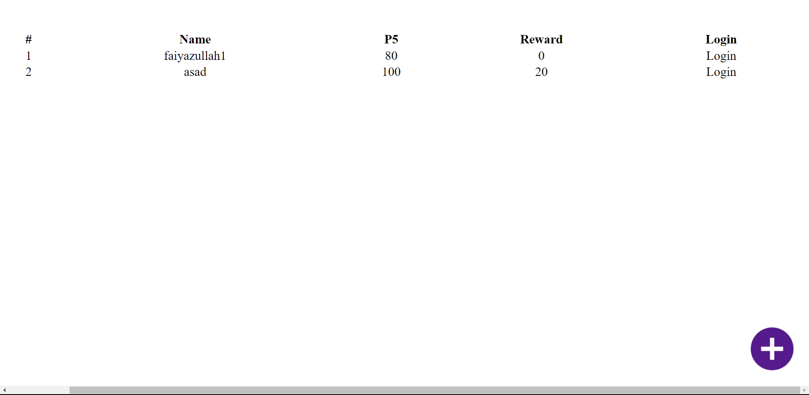
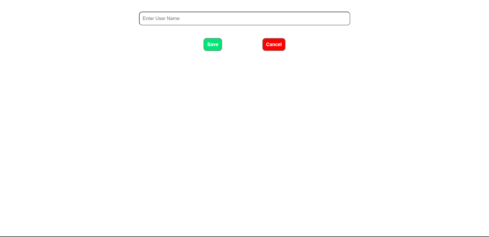
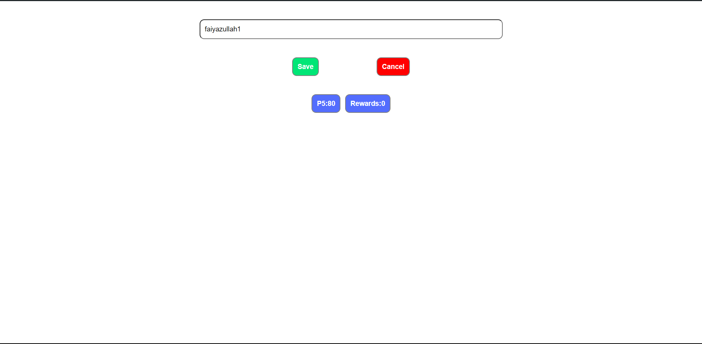
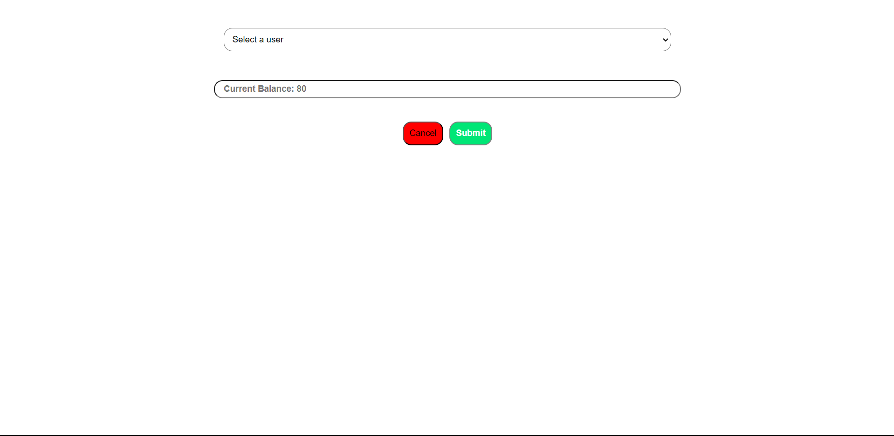

# Problem Statement

**Mini Peerfives** is a service that allows users to reward other people with peerfives (P5) points.

- Design a backed system to handle transaction of points between users.
  > **P5** - Points that can be given to others.
  > **Rewards** - Points that are earned and can not be given to others.
  >
  > - Entities/models
  >   - Users
  >     > ID - string
  >     > Name - string
  >   - Reward history
  >     > Datetime stamp
  >     > Points - number
  >     > Given by (User ID) - string
  >     > Given to (User ID) - string
- Keep the frontend minimal without using any css framework like bootstrap, tailwind, etc.
- Create a `README.md` file for ease of use.

# Getting Started

### Prerequisites

Your system must have Node.js installed in your system.
Nodemon (use `npm i nodemon` to install)

```bash

# after cloning the repo

cd backend
npm i
npm start

# new terminal

cd frontend
npm i
npm run dev
```

Now you can open and view the webpage on your local system.

# Completed

### Frontend

- Homepage with all users - Table of all users
  
- Create user: A form to create Page, click + on homepage to create
  
- Update User - Click on Login on homepage to update
  
- Send P5 points as a reward to other users - Click on P5 button on Update page to send reward
  

### Backend

- Models

  - User model, Reward model

- REST API
  - getAllUsers
  - createUser
  - viewUser
  - updateuser
  - transactions
